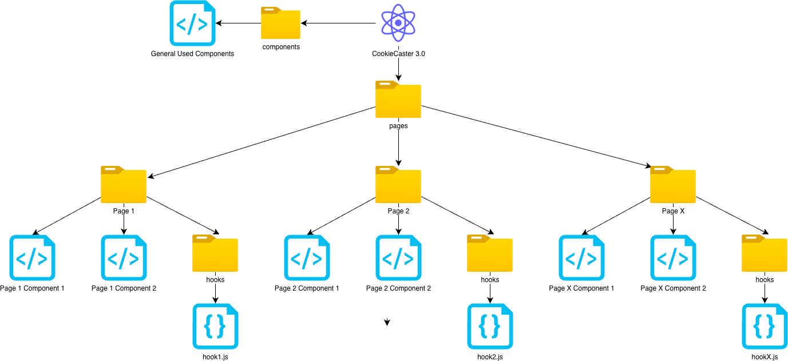

# Contributing to CookieCaster 3.0

CookieCaster 3.0 is an open-source project and thrives on community involvement. Contributions of all kinds are welcome — whether you’re improving documentation, reporting bugs, suggesting new features, or writing code.

This guide explains **how to contribute**, **how branching works**, and **how releases are handled**, so that contributions stay consistent and easy to review.

---

## Table of Contents

- [Introduction](#introduction)
- [Branching Concept](#branching-concept)
  - [Important Branches](#important-branches)
  - [Branch Naming](#branch-naming)
- [CI/CD](#cicd)
  - [Developing](#developing)
  - [Releasing](#releasing)
- [How to Review](#how-to-review)
- [Merging to Main](#merging-to-main)
- [Merging Releases](#merging-releases)
- [React Projet Structure](#react-project-structure)
  - [Directory Structure](#directory-structure)
  - [React Components Structure](#react-components-structure)
- [Creating a Branch](#creating-a-branch)
- [Commits](#commits)
- [Pull Requests](#pull-requests)
- [Testing](#testing)

---

## Introduction

To keep CookieCaster 3.0 maintainable and stable, this project follows a clear branching and release strategy.  
All contributors are expected to follow this concept to ensure clean pull requests and predictable releases.

Before you start working on something new, please:

- Check the [open issues](https://github.com/fhnw-makerverse/cookiecaster/issues)
- Look for issues labeled **`help wanted`** or **`good first issue`** if you’re new to the project

### Contribution Workflow (High-Level)

1. Create a branch from `development`
2. Implement your changes
3. Write tests if you add new functionality
4. Commit with clear, descriptive messages
5. Open a pull request back to `development`
6. Address review feedback if needed

---

## Branching Concept

### Important Branches

#### `main`
- Contains **production-ready code**
- Runs on **GitHub Pages**
- ❌ No direct pushes allowed
- Only updated via merges from `development`

#### `gh-pages`
- Contains only the generated files required for GitHub Pages
- Automatically updated via CI/CD
- ❌ No manual changes allowed
- Generated using `yarn deploy`

#### `development`
- Main working branch for ongoing development
- Always ahead of `main`
- All features, fixes, and improvements are merged here first
- Release branches are created from this branch

---

### Branch Naming

All contribution branches must be created **from `development`** and follow this naming convention:

| Branch Prefix   | Purpose                               | Example                  |
|-----------------|----------------------------------------|--------------------------|
| `feature/*`     | New features                           | `feature/share`          |
| `fix/*`         | Bug fixes                              | `fix/drawing-curves`     |
| `docs/*`        | Documentation changes                  | `docs/metrics`           |
| `chore/*`       | Maintenance or CI/CD changes           | `chore/add-ci-tests`     |
| `release/*`     | Prepare a new production release       | `release/v1.0.3`         |

---

## CI/CD

CookieCaster uses GitHub Actions to ensure code quality and stability.

### Developing

On every **pull request** to `development` or `main`:

- All tests are executed
- Code style and quality checks run
- Coverage reports are generated
- Coverage badges are updated in the README

❗ A pull request can only be merged if **all checks are green**.

---

### Releasing

The release process is fully automated using CI/CD.

1. A `release/vx.y.z` branch is created from `development`
2. `VERSION.md` is updated with the new version number
3. The update to `VERSION.md` triggers a GitHub Action which:
   - Updates the version in `package.json`
4. A pull request is opened to `development`
5. **Before merging the pull request**, verify that:
   - The GitHub Action has successfully updated `package.json`
   - All tests and checks have passed
6. The pull request is merged into `development`
7. `development` is merged into `main`
8. A Git tag and GitHub Release are created automatically
9. GitHub Pages are deployed automatically

---

## How to Review

Before merging a pull request, reviewers should:

- Ensure all CI pipelines are green
- Clone the branch locally
- Run `yarn run dev`
- Verify the application works as expected
- Check adherence to the branching concept
- Review commit messages for clear changelog entries

If all checks pass, the pull request may be merged.

---

## Merging to Main

### `development` → `main`

- Only merges from `development` to `main` are allowed
- If `VERSION.md` **is not changed**:
  - No new release is created
- If `VERSION.md` **is changed**:
  - A new release and deployment are triggered

---

## Merging Releases

### `release/*` → `development`

Use release branches **only** when publishing a new version.

Steps:
1. Create a branch: `release/vx.y.z` from `development`
2. Update `VERSION.md` with the new version number
3. Open a pull request to `development`
4. **Before merging**, verify that the GitHub Action has correctly updated the version in `package.json`
5. If the version update and all checks are successful, merge the pull request into `development`
6. Afterward, proceed with merging `development` into `main`

---

## React Project Structure

This section explains how the React project is structured. Understanding this layout will help you quickly find the right place to implement features, fixes, or documentation changes.

---

### Directory Structure

The following structure applies to the `src` directory:

| Path | Purpose |
|------|--------|
| `business-logic` | Core JavaScript logic providing functional behavior |
| `business-logic/graph-operations` | Functions related to drawing and graph operations |
| `business-logic/handlers` | Handlers for cutter forms |
| `business-logic/mesh-operations` | Functions related to mesh processing |
| `business-logic/modes` | All drawing modes |
| `business-logic/services` | Shared services (e.g. validation) |
| `entities` | Entity classes |
| `entities/graph` | Entities related to graph / drawboard |
| `entities/mesh` | Entities related to mesh handling |
| `templates` | Templates shown in the gallery |
| `translations` | German and English translation dictionaries |
| `ui` | All React UI and frontend-related code |
| `ui/components` | Shared components used across multiple pages |
| `ui/pages` | Page-specific components and hooks |
| `utils` | Utility scripts (e.g. file import/export) |

---

### React Components Structure

The following diagram illustrates how components inside the `ui` folder are organized:



**Guidelines:**

- Each page inside `ui/pages` has its own directory
- Page-specific components are stored in a `components` subfolder
- Page-specific hooks are stored in a `hooks` subfolder
- Reusable components shared across multiple pages belong in `ui/components`
- Application routing is defined in `App.jsx`
- Hash-based routing is used to ensure compatibility with GitHub Pages

---

## Creating a Branch

Before starting any work, create a new branch from `development` using the naming rules defined in  
[Branch Naming](./CONTRIBUTING.md#branch-naming)

```shell
git fetch --all
git pull
git checkout -b feature/new-page
```

You can now work on your feature, fix, or documentation update in this branch.

To start the local development server:

```shell
yarn run dev
```

---

## Commits

When your work is complete, commit your changes with clear and meaningful commit messages.

A good commit message includes:
- A short summary line
- An optional detailed description
- A reference to the related issue

**Example: Fix**
````
Fix flickering checkbox

On screen sizes around 760x760 the checkbox flickered continuously.

refs #4567
````

**Example: Feature**
````
Add share feature

Users can now share cut-outs via WhatsApp.
Requires JS library XY.

refs #4568
````

Multiple commits during development are allowed and encouraged.
Clear commit messages are essential, as they are used to generate the changelog.

---

## Pull Requests

Once your work is finished:
1. Push your branch to GitHub
2. Open a pull request targeting the development branch
3. Select a reviewer
4. Address all review comments and requested improvements

Pull requests are reviewed according to
[How to Review](./CONTRIBUTING.md#pull-requests)

After merging, your changes will be included in the next release.
See [Releasing](./CONTRIBUTING.md#releasing) for details.

---

## Testing

All new features and fixes **must include appropriate Jest tests**.

**Requirements**:
- Code coverage must remain between 80% and 100%
- Pull requests without tests will be declined
- Pull requests that reduce coverage below 80% will be declined

On every pull request:
- Code coverage is calculated automatically
- The README of the source branch is updated with a lines coverage badge

You can find existing tests in the `test` directory for reference.

Helpful resources:
- Existing test cases in the repository
- LLM assistance (optional)
- [Jest Documentation](https://jestjs.io/docs/getting-started) to write your test cases

Feel free to update existing test cases if you think they are not correct. Just write in the commit message why you did it. 

---

Thank you for contributing to CookieCaster 3.0 🚀  
Your help makes the project better for everyone.
